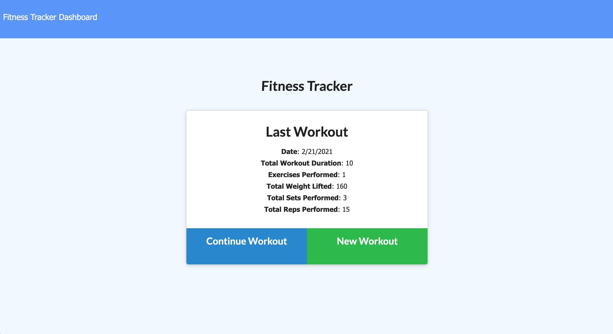

<h1 align="center">Workout Tracker</h1>

    
    
    

  
  
  
  
  
  

## Table of Contents
- [Description](#description)
- [Table of Contents](#table-of-contents)
- [Link](#heroku-link)
- [Screenshot](#screenshot)
- [Questions](#questions)

## Description
This application required creating a Mongo database with a Mongoose schema and handle routes with Express.

## Heroku link:
[Workout Tracker](https://warm-meadow-80270.herokuapp.com/)

#### Screenshot of application:

## Questions
:mailbox: Please contact me if you have any questions:
 
  
  
 

#### Powered by :coffee: and  

Thanks for stopping by! :vulcan_salute: